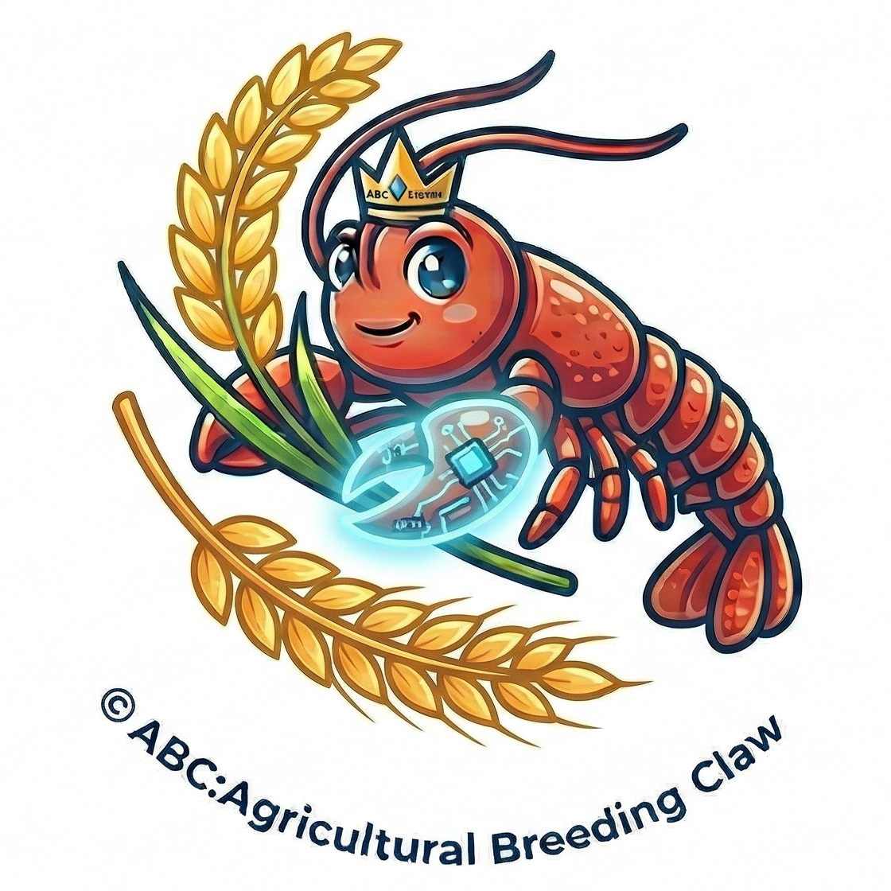

<div align="center">


# ABC: Agricultural Breeding Claw

### 农业育种智能研究助手

[English](README.md) | [简体中文](README.zh-CN.md)

[](https://www.python.org)
[](https://nodejs.org)
[](https://react.dev)
[](https://fastapi.tiangolo.com)
[](LICENSE)

</div>

<br/>

**ABC** 是一个面向农业育种科研人员的 AI 辅助分析平台。用户无需编程，通过自然语言即可完成差异表达分析、KEGG/GO 富集分析、BLAST 序列比对和基因本体可视化等育种研究任务。

基于 [LangChain](https://github.com/langchain-ai/langchain) ReAct Agent 框架与千问大语言模型，构建了"传统统计工具 + LLM 推理"双轨并行分析机制。

## 目录

- [概览](#概览)
- [使用方式](#使用方式)
- [快速开始](#快速开始)
- [核心功能](#核心功能)
- [内置数据集](#内置数据集)
- [系统架构](#系统架构)
- [技术栈](#技术栈)
- [项目结构](#项目结构)
- [注意事项](#注意事项)
- [许可证](#许可证)

## 概览

基因组数据的快速增长给育种研究人员带来了较高的计算门槛。DESeq2、edgeR 等工具需要编程能力，对以田间实验为主的育种学家而言使用门槛较高。

**ABC** 通过对话式界面解决这一问题，研究者可以：

- **差异表达分析** — 基于 t-test / DESeq2 的 DEG 分析，火山图可视化
- **富集分析** — 使用本地 MH63 水稻注释库进行 GO/KEGG 富集（离线，无需外部 API）
- **BLAST 比对** — 支持 blastn / blastp / blastx / tblastn，本地 MH63 数据库
- **双轨验证** — 统计工具与 LLM 推理并行执行，一致性评分量化互补性
- **文件上传** — 拖拽表达矩阵、基因列表或 FASTA 文件即可分析

## 使用方式

### 自然语言对话

```
分析 WT 和 osbzip23 的差异表达基因
对差异分析中的显著基因做 KEGG/GO 富集分析
帮我比对这条序列：ATGCGATCGATCG...
```

### 命令模式

```
/analyze --control WT --treatment osbzip23
/analyze --control WT --treatment osbzip23 --pvalue 0.01 --log2fc 2
/tools      # 查看所有可用工具
/datasets   # 查看可用数据集
```

### 文件上传

- **基因表达矩阵**（TSV/CSV）：上传后指定对照组和处理组，自动执行差异分析
- **基因 ID 列表**（TXT）：上传后直接执行富集分析
- **FASTA 序列文件**：上传后直接执行 BLAST 比对

## 快速开始

### 环境要求

- Python 3.10+
- Node.js 18+
- 千问 API Key（[申请地址](https://dashscope.aliyun.com)）

### 后端

```bash
cd backend
pip install -r requirements.txt

# 配置 API Key
echo "QWEN_API_KEY=your_api_key_here" > .env

# 启动
PYTHONPATH=backend uvicorn app.main:app --reload --port 8003
```

### 前端

```bash
# 在项目根目录
npm install
npm run dev
```

### 访问地址

| 服务 | 地址 |
|------|------|
| 前端 | http://localhost:3003 |
| 后端 API | http://localhost:8003 |
| API 文档（Swagger） | http://localhost:8003/docs |

## 核心功能

### 双轨差异表达分析

统计工具轨道与 LLM 推理轨道并行执行：

- **工具轨道**：全基因组 t 检验，log2FC + p 值过滤，火山图输出
- **LLM 轨道**：千问模型基于生物学先验知识对表达数据进行推理
- **一致性分析**：重叠率量化，识别两种方法共同确认的高置信基因

在 GSE242459 数据集上验证，两轨道基因重叠率达 **83.3%**，LLM 能识别严格统计阈值遗漏的生物学候选基因。

### KEGG/GO 富集分析

本地 MH63 水稻注释数据库（Fisher 精确检验 + BH 校正）：

- 气泡图（富集分数 vs 通路，气泡大小为基因数）
- 可排序结果表格，支持 KEGG 通路图跳转

### BLAST 序列比对

支持 blastn / blastp / blastx / tblastn，本地 MH63 数据库：

- 命中序列表格（相似度、E-value、覆盖度）
- 序列比对详情


## 内置数据集

水稻转录组数据集 **GSE242459**（OsbZIP23 转录因子胁迫条件下的表达谱）：

| 分组 | 样本 |
|------|------|
| 对照组 (WT) | DS_WT_rep1, DS_WT_rep2, N_WT_rep1, N_WT_rep2, RE_WT_rep1, RE_WT_rep2 |
| 处理组 (osbzip23) | DS_osbzip23_rep1, DS_osbzip23_rep2 |

## 系统架构

```
┌─────────────────────────────────────────────────────┐
│                    表示层                            │
│  React 18 + TypeScript + Recharts + React Flow      │
│  对话界面 | 火山图 | 富集气泡图 | 本体知识图谱        │
├─────────────────────────────────────────────────────┤
│              SSE 实时流（进度推送）                   │
├─────────────────────────────────────────────────────┤
│                    服务层                            │
│  FastAPI | AnalysisService | LLMService             │
│  OntologyService | DatasetService | FeedbackService │
├─────────────────────────────────────────────────────┤
│                    Agent 层                          │
│  LangChain ReAct Agent（千问 LLM）                   │
│  差异表达工具 | 富集分析工具 | BLAST 工具             │
├─────────────────────────────────────────────────────┤
│                    数据层                            │
│  表达矩阵 (TSV) | GO/KEGG 注释库 | BLAST 数据库 (MH63) │
└─────────────────────────────────────────────────────┘
```

## 技术栈

| 层 | 技术 |
|----|------|
| 前端 | React 18 + TypeScript + Vite + Ant Design |
| 后端 | FastAPI + LangChain Agent + 千问 API |
| 数据分析 | Pandas / SciPy / PyDESeq2 / goatools / statsmodels |
| 序列比对 | BLAST+（本地） |
| 可视化 | Recharts + React Flow |

## 项目结构

```
ABC-Agricultural-Breeding-Claw/
├── backend/
│   ├── app/
│   │   ├── main.py              # FastAPI 应用入口
│   │   ├── config.py            # 配置管理
│   │   ├── agent/               # LangChain ReAct Agent
│   │   ├── tools/               # 分析工具（差异分析、富集、BLAST）
│   │   ├── routers/             # API 路由
│   │   ├── services/            # 业务逻辑
│   │   └── models/              # 数据模型
│   ├── data/
│   │   ├── datasets/            # 数据集文件
│   │   └── annotations/         # MH63 注释文件（GO/KEGG）
│   └── requirements.txt
├── src/                         # 前端源码
│   ├── pages/                   # 页面组件
│   ├── components/              # 可复用组件
│   ├── api/                     # API 客户端
│   └── hooks/                   # 自定义 Hooks
├── docs/
│   └── paper/                   # 技术论文
├── package.json
└── vite.config.ts
```


## 许可证

MIT
